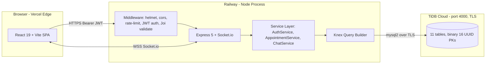
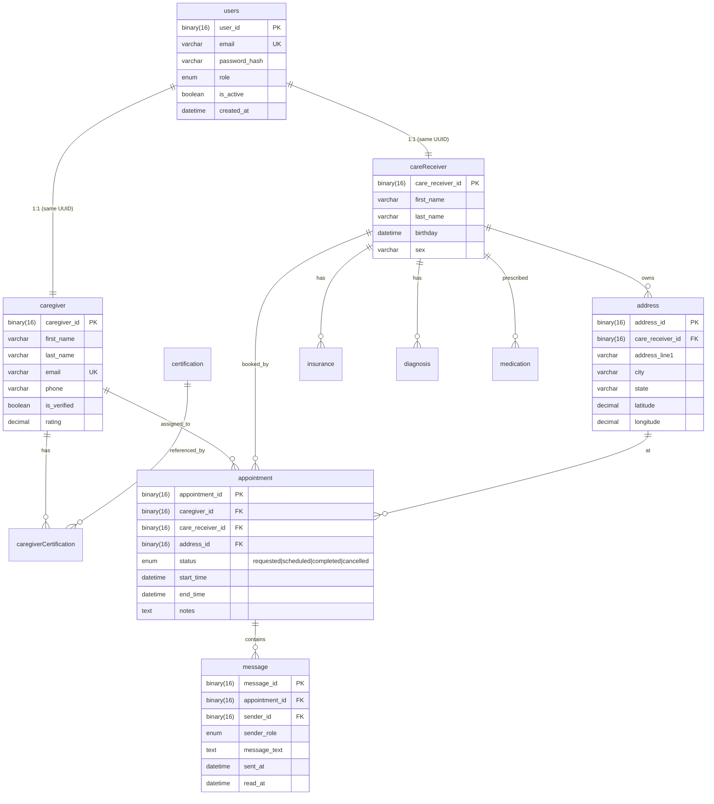

# CareConnect — Project Plan v2 (Demo Sprint)
## Home-care marketplace · CSC33600 Spring 2026 · The Honest Path to Demo Day

> This document supersedes the original `PROJECT_PLAN.md`. It reflects the team's May 2 2026 strategic pivot to ship a tight working demo instead of a wide broken one. Read it once top to bottom. After that, jump to the section that names you.

---

## Table of Contents

1. [TL;DR](#1-tldr)
2. [Where We Are Today](#2-where-we-are-today)
3. [The Pivot — Why We Cut Scope](#3-the-pivot--why-we-cut-scope)
4. [System Architecture](#4-system-architecture)
5. [The Database — Joshua's TiDB Schema](#5-the-database--joshuas-tidb-schema)
6. [The Five-Step Demo Flow (the only thing that has to work)](#6-the-five-step-demo-flow)
7. [The Appointment State Machine](#7-the-appointment-state-machine)
8. [Per-Person Workplan](#8-per-person-workplan)
9. [The Demo Script (7–8 minutes, click-by-click)](#9-the-demo-script)
10. [Risk Register](#10-risk-register)
11. [Success Criteria](#11-success-criteria)
12. [Timeline & Checkpoints](#12-timeline--checkpoints)
13. [Reference: API Endpoints](#13-reference-api-endpoints)
14. [Reference: Env Vars, Credentials, URLs](#14-reference-env-vars-credentials-urls)
15. [Reference: JWT Payload + UUID Handling](#15-reference-jwt-payload--uuid-handling)
16. [FAQ](#16-faq)
17. [Appendix A: Using Claude Code on This Repo](#17-appendix-a-using-claude-code-on-this-repo)
18. [Appendix B: What's in v2 (and why we cut it from v1)](#18-appendix-b-whats-in-v2-and-why-we-cut-it-from-v1)
19. [Appendix C: Glossary](#19-appendix-c-glossary-so-nothing-here-is-jargon)
20. [Appendix D: First 30 Minutes onboarding](#20-appendix-d-first-30-minutes-your-onboarding-cheat-sheet)

---

## 1. TL;DR

**Where we are.** The backend is real, security-audited, and adapted to Joshua's live TiDB Cloud schema. The frontend is a static React mockup with hardcoded fake data. Nothing is deployed to a public URL. **Five of six teammates have zero commits.** We have one week of engineering left.

**What we decided.** Ship a tight, working five-step demo: **register → book → caregiver accepts → in-app chat → mark complete**. Cut reviews, ratings, live tracking, job-alert notifications, caregiver availability, and AI matching from v1. Move them to a v2 slide. Stage the cut as engineering maturity, not failure — every shipping team in the world cuts scope, this is the rubric.

**What ships by Friday May 8 2026.**

| Person | One-line deliverable |
|---|---|
| **Arsenii** | Backend deployed to Railway with TiDB connection live; CORS configured. |
| **Joshua** | Auth migration run on TiDB; one reporting endpoint returning real data. |
| **Axyl** | React Router + AuthContext + login/register/book/chat pages wired to deployed backend. |
| **Atai** | Pair with Axyl on `RegisterPage` + caregiver `HomePage`; ship `Dockerfile` + 90-sec backup video. |
| **Faisal** | One scoped feature: smart-match endpoint OR drop the OpenAI logo from the deck. |
| **Abdullah** | README polish PR + at least 2 commits pairing on either backend or frontend. |

**One blocking action above all others:** the `users` auth table does not yet exist on TiDB. Joshua runs the migration, or we have no demo. See [§8.2](#82-joshua--reporting--tidb-owner).

---

## 2. Where We Are Today

The honest audit. No spin.

### 2.1 The build state vs the pitch

| Pitched feature | Status | Notes |
|---|---|---|
| Care receiver: Create profile | ⚠️ Backend yes, frontend no | `POST /auth/register` works via curl; UI not wired. |
| Care receiver: Book care | ⚠️ Backend yes, frontend no | `POST /appointments` works; UI is mock. |
| Care receiver: Confirm booking | ⚠️ Backend yes, frontend no | Caregiver accept flow exists. |
| Care receiver: **Track visit (ETA + live)** | ❌ Cut | No `caregiver_locations` table in Joshua's schema. v2. |
| Care receiver: **Rate & Review** | ❌ Cut | No `reviews` table in Joshua's schema. v2. |
| Caregiver: Create profile | ⚠️ Backend yes, frontend no | Same as above. |
| Caregiver: **Set availability** | ❌ Cut | No `caregiver_availability` table. v2. |
| Caregiver: **Receive job alert** | ❌ Cut | No `notifications` table. Polling list works as substitute. |
| Caregiver: Check-in + complete tasks | ⚠️ Half | "Complete" works. No `in_progress` state in TiDB. No `appointment_tasks` table. |
| Caregiver: Receive rating | ❌ Cut | Tied to reviews. v2. |

### 2.2 The infrastructure state

| Layer | Promised | Reality |
|---|---|---|
| Frontend framework | Next.js + React | Vite + React 19 (functionally fine; slide needs updating) |
| Backend framework | Node.js + Express | ✅ Done — Express 5 with full middleware stack |
| Database | MySQL | TiDB Cloud (MySQL-compatible, port 4000, SSL required) |
| Deployment | Docker | No `Dockerfile` yet; backend not deployed |
| AI | OpenAI integration | No code written |
| CI/CD | Implied by deployment slide | None |
| Auth | JWT (15min access + 7d refresh) | ✅ Done; refresh token rotation in place |
| Real-time chat | Socket.io | ✅ Per-appointment chat handler ready |

### 2.3 The team commit reality

```
$ git log --oneline
b1d8494 Add Netlify config for frontend build
55d9d46 Add frontend folder from local frontend branch
60c1a04 Adapt backend to Joshua's TiDB Cloud schema
b47a662 Add interview prep docs
a1835ad Security audit: fix 12 vulnerabilities
46c50d0 Implement appointment lifecycle state machine
51602b6 Fix 4 API bugs
5aac09c Initial backend setup
```

Eight commits. One author. The rest of this document is built around that fact, not in spite of it.

### 2.4 What is genuinely strong

This is what we're going to lean on for the demo:

- A real **finite state machine** for appointment lifecycle with race-condition-safe atomic updates — this is interview-grade backend work.
- A **security audit document** that fixed 12 real vulnerabilities (SQL injection, mass-assignment, race conditions, path traversal, weak JWT secret detection). Most class projects don't have this.
- A **live cloud database** with binary(16) UUIDs, FK constraints, and the kind of schema migration story that maps directly to a real engineering problem.
- A **working API surface** of ~20 endpoints with Joi validation, RBAC, rate limiting, helmet headers, and central error handling.

The pitch lost some features. The engineering didn't.

---

## 3. The Pivot — Why We Cut Scope

### 3.1 What we promised in the pitch deck

The original deck (`CSC336 Pitch Slides.pptx.pdf`) committed to two five-step user journeys (10 features total), Next.js, Docker, and OpenAI. It was a great pitch. It was not a 14-week build.

### 3.2 What we shipped vs what we cut

| Category | Shipped (v1) | Cut → moved to v2 |
|---|---|---|
| Identity | Register, login, JWT refresh, role-based access | — |
| Discovery | Caregiver search & profile view | AI smart-match (Faisal optional) |
| Booking | Create, list, accept, decline, cancel, complete | Caregiver availability windows |
| Communication | Per-appointment chat (REST + Socket.io) | Push notifications, job-alert broadcast |
| Tracking | Status badge | Live GPS tracking + ETA |
| Trust | Verified flag on caregiver | Reviews & ratings, background-check workflow |
| Money | — | Stripe integration, payment splits |
| Admin | Dashboard endpoint with appointment counts | Charts, revenue analytics |

### 3.3 Why this is the right call

A class demo grader has seen capstone projects implode because teams committed to too much. **A team that ships a small product end-to-end, explains exactly what they cut and why, and points at a clear v2 roadmap looks competent. A team that demos 10 broken screens does not.**

We frame this in the deck like this:

> "We promised 10 features across two journeys. We shipped 5 that work end-to-end and migrated the entire backend to TiDB Cloud mid-build. Here's our security audit. Here's our state-machine design. Here's what's deliberately staged for v2."

> **🚨 Non-negotiable rule for the rest of the sprint:** Nobody adds a feature that isn't in §6. Not a stretch goal, not a "while I'm in there." Polish what we have. Cut what doesn't fit.

---

## 4. System Architecture

### 4.1 Live diagram



### 4.2 Layer responsibilities

| Layer | Stack | Lives at | Owner |
|---|---|---|---|
| Frontend | React 19, Vite, vanilla CSS | `frontend/` | Axyl |
| API gateway | Express 5, helmet, cors, rate-limit | `src/app.js`, `src/middleware/` | Arsenii |
| Service layer | Pure JS business logic | `src/services/*.service.js` | Arsenii |
| Data access | Knex.js (no ORM) | `src/models/*.model.js` | Arsenii |
| Database | TiDB Cloud (MySQL 8 dialect) | `tidb-cloud:4000` | Joshua |
| Real-time | Socket.io with JWT handshake | `src/socket/` | Arsenii |
| Auth | JWT access (15min) + refresh (7d) | `src/services/auth.service.js` | Arsenii |
| Reporting | Knex aggregate queries on `appointment` | `src/controllers/admin.controller.js` | Joshua |
| Deploy | Railway (backend, long-lived Express + Socket.io), Vercel (frontend, Vite static + edge) | — | Arsenii (backend) + Atai (frontend deploy + Dockerfile) |

### 4.3 Why this stack (one paragraph)

Express + Knex over a heavier framework like NestJS or an ORM like Sequelize because the goal is to learn SQL, not to hide from it. JWT over sessions because it's stateless and demos cleanly without a Redis dependency. Socket.io over raw WS because it auto-reconnects and falls back to long-polling — exactly the failure modes we don't want surfacing on demo day. TiDB because Joshua already provisioned it and the migration cost of switching back to MySQL would buy us nothing.

---

## 5. The Database — Joshua's TiDB Schema

### 5.1 The schema, as it actually exists



### 5.2 The translation table (old plan → reality)

If you read the original `PROJECT_PLAN.md` and got confused by the schema differences, this is why:

| Original plan (v1.0 schema) | Joshua's actual schema | What changed |
|---|---|---|
| `users.id` INT auto-increment | `users.user_id` binary(16) UUID | All IDs are UUIDs now. Use `uuid_to_bin()` / `bin_to_uuid()`. |
| `users` + `caregiver_profiles` (separate IDs) | `users` + `caregiver` (same ID) | Profile-table indirection is GONE. `req.user.id` IS `caregiver_id`. |
| `appointments` (snake_case plural) | `appointment` (camelCase singular) | Joshua chose camelCase singular. Don't fight it. |
| `status: pending|accepted|in_progress|completed|cancelled|no_show` | `status: requested|scheduled|completed|cancelled` | Simpler FSM. No check-in step. |
| `addresses.user_id` | `address.care_receiver_id` | Caregivers don't have addresses in this schema. |
| `caregiver_availability`, `notifications`, `reviews`, `payments`, `caregiver_locations`, `appointment_tasks`, `service_types` | None of these exist | Cut to v2. |

### 5.3 The auth-table migration

Joshua's schema does not include a `users` table. We added one in `database/migrations/20260403000001_add_users_auth.js`. **It has not been run yet.** The whole project is gated on this. See [§8.2](#82-joshua--reporting--tidb-owner).

```js
// database/migrations/20260403000001_add_users_auth.js
exports.up = function (knex) {
  return knex.schema.createTable('users', (table) => {
    table.specificType('user_id', 'binary(16)').primary();
    table.string('email', 255).unique().notNullable();
    table.string('password_hash', 255).notNullable();
    table.enu('role', ['caregiver', 'care_receiver', 'admin']).notNullable();
    table.boolean('is_active').defaultTo(true);
    table.datetime('created_at').defaultTo(knex.fn.now());
  });
};
```

> **⚠️ Watch out:** TiDB Cloud is MySQL-compatible but uses port `4000` and requires SSL. The `knexfile.js` already auto-detects this with `ssl: process.env.DB_PORT === '4000' ? { rejectUnauthorized: true } : undefined`. Don't change it.

---

## 6. The Five-Step Demo Flow

The only flow that has to work end-to-end on demo day. Everything else is decoration.

| # | User action | Frontend call | Backend effect | Endpoint |
|---|---|---|---|---|
| 1 | Care receiver registers | `POST /api/v1/auth/register` | New row in `users` + `careReceiver`. JWT pair returned. | `auth.controller.js#register` |
| 2 | Care receiver creates an address (one-time, on the booking screen) | `POST /api/v1/addresses` | New row in `address` linked to `care_receiver_id`. Returns `address_id`. | `address.controller.js#create` |
| 3 | Care receiver books care (uses the `address_id` from step 2) | `POST /api/v1/appointments` | New row in `appointment` with `status='requested'`, `caregiver_id=NULL`. | `appointment.controller.js#create` |
| 4 | Caregiver logs in, lists open requests, accepts one | `GET /api/v1/appointments?status=requested` then `POST /api/v1/appointments/:id/accept` | List query returns rows where `caregiver_id IS NULL` (see §13.1 caregiver-discovery semantic). Accept does atomic update: `status='scheduled'`, `caregiver_id=<them>`. | `appointment.controller.js#list`, `appointment.service.js#accept` |
| 5 | Both parties chat in-app | `GET /api/v1/appointments/:id/messages` + `POST /api/v1/appointments/:id/messages` (poll every 3s) | Insert into `message` with `sender_role`. Both browsers re-fetch. | `chat.service.js` |
| 6 | Caregiver marks complete | `POST /api/v1/appointments/:id/complete` | `status='completed'`. Care-receiver browser polls `/appointments/:id` and updates badge. | `appointment.service.js#complete` |

> **⚠️ Hidden prerequisite caught in review:** the original five-step flow assumed an address already existed. It doesn't — newly registered care receivers have zero addresses. The booking screen MUST create an address (`POST /addresses`) before creating the appointment (`POST /appointments`). The frontend handles this transparently in `BookPage.jsx` ([§8.3.2](#832-friday-may-8-deliverables)).

**Time budget on this flow: ~4 minutes live (longer than it sounds because live registration is 45–60 seconds alone).** See [§9.1](#91-the-slide-by-slide-realistic-timing--78-minutes) for the full demo timing — the rest of the demo (architecture, FSM, security audit, v2 roadmap) consumes the other ~3 minutes.

---

## 7. The Appointment State Machine

### 7.1 The diagram

```
   ┌───────────┐  accept   ┌───────────┐  complete  ┌───────────┐
   │ requested ├──────────►│ scheduled ├───────────►│ completed │
   └─────┬─────┘           └─────┬─────┘            └───────────┘
         │                       │
         │ cancel                │ cancel
         ▼                       ▼
   ┌───────────┐           ┌───────────┐
   │ cancelled │           │ cancelled │
   └───────────┘           └───────────┘

Terminal states: completed, cancelled (no transitions out)
```

### 7.2 Authorization rules per transition

| Transition | Who can fire it | Side effects |
|---|---|---|
| `requested → scheduled` | Any verified caregiver, only if `caregiver_id IS NULL` | Atomic UPDATE with WHERE clause to prevent race condition |
| `requested → cancelled` | The booking care receiver | Sets `cancelled_at`, `cancelled_reason` |
| `scheduled → completed` | Only the assigned caregiver | — |
| `scheduled → cancelled` | The care receiver OR assigned caregiver | Sets `cancelled_at`, `cancelled_reason` |

### 7.3 Why this matters (talk track for the demo)

Without an FSM, you'd need ad-hoc `if/else` checks scattered across controllers, and bugs would let users "complete" a cancelled appointment or "cancel" one already done. The state machine centralizes the rules. The accept transition uses an **atomic conditional UPDATE** (optimistic locking) so two caregivers tapping "Accept" at the same instant can't both win — exactly the concurrency case professors love to ask about.

```js
// src/services/appointment.service.js — the race-safe accept
const affectedRows = await db('appointment')
  .whereRaw(whereUuid('appointment_id'), [appointmentId])
  .where({ status: 'requested' })
  .whereNull('caregiver_id')
  .update({
    caregiver_id: db.raw('uuid_to_bin(?)', [userId]),
    status: 'scheduled',
  });

if (affectedRows === 0) {
  throw ApiError.conflict('Already accepted by another caregiver');
}
```

---

## 8. Per-Person Workplan

Every person below has: a one-line role recap, a one-paragraph "why this matters," a Friday checklist, acceptance criteria (binary), copy-paste commands or starter code, and a fallback if blocked. Roles are real. Names are real. Nobody is being sandbagged — this is what we agreed to in the pitch deck.

### 8.0 Arsenii — Individual contribution evidence (read this first)

This sub-section is for Arsenii alone, but everyone should see it so the work distribution is transparent.

**Why this exists.** The repo currently shows 8 commits, all by one author. If the rubric weights individual contribution separately from group demo quality (it usually does in CUNY CS capstones), Arsenii needs his individual work to be legible to the grader without the grader having to dig.

**What Arsenii ships ALONGSIDE the per-person work.**
- [ ] `docs/contribution-log.md` — date-stamped log of every significant change (migrations, controllers, services, audit fixes), with file paths. Already half-written via the commit messages; consolidate into one file.
- [ ] `docs/interview-prep/architecture-decisions.md` — the architecture decision record (ADR) format: what we built, why, what we considered, what we rejected. Five entries minimum: state machine, JWT vs sessions, Knex vs ORM, TiDB migration, scope cut. **30 minutes of writing per entry.**
- [ ] **Talk to the professor before demo day.** This is the most important non-coding action on the entire plan. One short email, one office-hours visit. Tell the truth: "I've owned ~95% of the engineering. I want to flag this so individual contribution can be evaluated separately from the group demo." Do not frame this as a complaint — frame it as transparency. The professor will respect it, and they will check `git log --author` themselves anyway.

**Why the professor conversation matters more than any code.** A good demo with hidden contribution disparity reads worse than a smaller demo with documented contribution. Graders dislike being surprised post-hoc.

**Suggested email template:**

```
Subject: CSC33600 — flagging contribution disparity ahead of demo

Hi Professor [Name],

Quick heads-up before our team's final demo on [DATE]: I've been the primary
engineering contributor on CareConnect — eight of eight commits in the repo are mine.
I want to flag this transparently so you can evaluate individual contributions
appropriately.

Our team has chosen to scope the demo down to a tight five-step working flow
(register → book → accept → chat → complete), rather than the ten features in our
original pitch. I'm happy to walk you through the architecture, security audit, and
state-machine design separately if that's useful for grading.

Repo: https://github.com/ArseniiChan/CareConnect
Branch: main

Let me know if you'd like a one-on-one before the demo.

Thanks,
Arsenii
```

> **⚠️ Watch out:** Send this no earlier than Wednesday May 7 (so it's not "throwing teammates under the bus" before they've had a real chance) and no later than the morning of demo day.

### 8.1 Arsenii — Backend & Database

**Role recap.** You own the API surface, the service layer, and the security posture.

**Why this matters.** The 5-step demo lives or dies on whether your endpoints work in production. Three of your endpoints (`/auth/login`, `/appointments`, `/appointments/:id/messages`) are the demo. Everything Axyl builds will hit them in the next 4 days.

**Friday May 8 deliverables.**
- [ ] Backend running on a public Railway URL with TiDB connection live.
- [ ] `npm run seed` produces working demo accounts on TiDB — verified by a SELECT against TiDB after seeding.
- [ ] CORS configured for Vercel origin (no wildcards in production env).
- [ ] One smoke-test curl in the README that anyone can run to verify the deploy.
- [ ] **Local end-to-end smoke test BEFORE deploy:** run `npm run dev` against TiDB, hit `/auth/login` with curl, confirm response shape matches §13's canonical example. Only THEN deploy.
- [ ] Post canonical example response shape to Discord by Monday noon (so Axyl isn't guessing). See §13.
- [ ] You handle any backend bug Axyl reports within 2 hours.

**Acceptance criteria.**
- ✅ Done means: from any laptop, `curl https://<railway-url>/health` returns `200 OK`.
- ✅ Done means: `curl -X POST https://<railway-url>/api/v1/auth/login -H "Content-Type: application/json" -d '{"email":"dorothy.chen@example.com","password":"Password123!"}'` returns a JWT pair matching §13.
- ✅ Done means: Joshua's migration ran successfully BEFORE this deploy (otherwise login will 500).

**Exact commands.** Sequence matters — Joshua's §8.2 step runs first.

```bash
# 1. Install Railway CLI and login
npm i -g @railway/cli
railway login
railway init

# 2. Set env vars FIRST (before deploy — otherwise the container starts crashlooping)
railway variables set NODE_ENV=production
railway variables set DB_HOST=<tidb-host>
railway variables set DB_PORT=4000
railway variables set DB_USER=<tidb-user>
railway variables set DB_PASSWORD=<tidb-password>
railway variables set DB_NAME=<tidb-database>
railway variables set JWT_SECRET=$(openssl rand -hex 32)
railway variables set JWT_ACCESS_EXPIRY=60m
railway variables set JWT_REFRESH_EXPIRY=7d
railway variables set CORS_ORIGIN="https://<vercel-prod-url>,https://<vercel-preview-pattern>,http://localhost:5173"

# 3. Deploy
railway up

# 4. Generate a public domain
railway domain
# Copy the URL — paste it in Discord IMMEDIATELY so Axyl can wire up

# 5. Verify
curl https://<your-railway-url>/health
curl -X POST https://<your-railway-url>/api/v1/auth/login \
  -H "Content-Type: application/json" \
  -d '{"email":"dorothy.chen@example.com","password":"Password123!"}'
```

**If blocked.** Railway acting up → fall back to Render.com (same deploy model, free tier). If TiDB blocks egress from Railway → use TiDB Cloud's IP allowlist to add Railway's outbound IP range.

---

### 8.2 Joshua — Reporting & TiDB Owner

**Role recap.** You own the database. Without you, nothing else can move.

**Why this matters.** **You are the single biggest unblock on the team right now.** The auth migration in `database/migrations/20260403000001_add_users_auth.js` has to be applied to TiDB before anyone can register, log in, book, accept, or message. Until you run that one command, the entire team is blocked on you.

**Friday May 8 deliverables.**
- [ ] **SUNDAY MAY 3 OR MONDAY MAY 4 AT THE LATEST, ON THE CALL:** Run the auth migration on TiDB Cloud. Screenshare. Live.
- [ ] Run the seed file (`npm run seed`) to populate demo data.
- [ ] Deliver a one-paragraph "what's in TiDB right now" status to the team.
- [ ] Add ONE reporting endpoint: appointments-per-day for the last 30 days, returned as `{date, count, completed}[]`. Wire it into `src/controllers/admin.controller.js` (it's already half there).
- [ ] Verify TiDB allows connections from Railway's IP range (add to allowlist if needed).

**Acceptance criteria.**
- ✅ Done means: `SELECT COUNT(*) FROM users` on TiDB returns ≥4 (admin + 2 caregivers + 1 care receiver from the seed).
- ✅ Done means: `GET /api/v1/admin/appointments/stats?period=30d` returns a valid JSON array on the deployed backend.

**Exact commands.**

```bash
# Clone the repo (if you haven't)
git clone https://github.com/ArseniiChan/CareConnect.git
cd CareConnect
npm install

# Configure .env with TiDB credentials
cp .env.example .env
# Edit DB_HOST, DB_PORT=4000, DB_USER, DB_PASSWORD, DB_NAME

# Run the auth migration
npm run migrate

# Verify it worked
mysql -h <tidb-host> -P 4000 -u <user> -p --ssl-mode=VERIFY_IDENTITY \
  -e "SHOW TABLES IN <db>; DESCRIBE users;"

# Seed demo data
npm run seed
```

**If blocked.** Migration fails because `users` already exists → no-op, you're done. Migration fails on a syntax error → ping Arsenii immediately, do not work around it. TiDB credentials missing → DM Arsenii for the `.env` values.

> **🚨 Blocking:** If this isn't done by Monday May 4 EOD, Arsenii takes the credentials and runs it himself. The whole team waiting on one teammate is the single biggest project-killer here. We're not letting it happen.

---

### 8.3 Axyl — Frontend

**Role recap.** You turn a static React mockup into a functioning client of the deployed API.

**Why this matters.** The demo grader will not look at the backend. They'll look at the screen. **The frontend↔backend connection IS the demo.** A backend nobody can click and a mockup with fake data both score zero. You connecting them is the project.

#### 8.3.1 Frontend architecture (the structure Josh proposed, with guardrails)

The architecture Josh outlined is correct and matches our backend RBAC. Build it like this:

```
frontend/src/
├── App.jsx                    ← React Router + auth state + top-level layout
├── api/
│   └── client.js              ← Single fetch wrapper (see code block below)
├── auth/
│   ├── AuthContext.jsx        ← React Context: { user, token, login, logout, loading }
│   └── ProtectedRoute.jsx     ← <ProtectedRoute role="caregiver"> wrapper
├── pages/
│   ├── LoginPage.jsx          ← Email + password
│   ├── RegisterPage.jsx       ← Asks role first ("Are you a caregiver or care receiver?")
│   ├── care-receiver/
│   │   ├── HomePage.jsx       ← Upcoming appointments, "Book Care" CTA
│   │   └── BookPage.jsx       ← Form: address, time, notes
│   ├── caregiver/
│   │   ├── HomePage.jsx       ← Open requests list (no map — see note below)
│   │   └── MyJobsPage.jsx     ← Scheduled jobs assigned to me
│   └── shared/
│       ├── AppointmentDetailPage.jsx ← Status, details, link to chat
│       └── ChatPage.jsx       ← Per-appointment messages
└── components/
    ├── StatusBadge.jsx
    ├── NavBar.jsx
    └── AppointmentCard.jsx
```

**Routes & access control:**

| Route | Public / Auth / Role | Component |
|---|---|---|
| `/` | Public | Landing or redirect to `/login` |
| `/login` | Public | `LoginPage` |
| `/register` | Public | `RegisterPage` (asks role first) |
| `/home` | Auth (any role) | Redirects to `/care-receiver/home` or `/caregiver/home` based on role |
| `/care-receiver/*` | Auth + role=`care_receiver` | Care-receiver routes |
| `/caregiver/*` | Auth + role=`caregiver` | Caregiver routes |
| `/appointments/:id` | Auth + must be participant | `AppointmentDetailPage` |
| `/appointments/:id/chat` | Auth + must be participant | `ChatPage` |

> **⚠️ Important:** The frontend route guards are UX, not security. The backend already enforces RBAC on every endpoint. If a malicious user types a URL into the address bar, the API will 403 them. Don't rely on the frontend for security.

**Auth gate logic:**
```jsx
// auth/AuthContext.jsx — simplified
useEffect(() => {
  const token = localStorage.getItem('token');
  if (!token) { setLoading(false); return; }
  api('/api/v1/auth/me')
    .then((res) => setUser(res.data))
    .catch(() => localStorage.removeItem('token'))
    .finally(() => setLoading(false));
}, []);
```

**On Tailwind (Josh suggested it):** Pick ONE path on Monday — don't half-migrate.

| Path | When to choose | Cost | Risk |
|---|---|---|---|
| **Keep vanilla CSS** (Aurora theme already in `App.css`) | Default. Pick this unless Axyl is genuinely faster in Tailwind. | 0h migration | Low — visual style already locked in |
| **Wholesale Tailwind swap** | Only if Axyl is fast in Tailwind AND can finish the swap by Tuesday. | ~3–4h migration | Medium — need to redo theme tokens, animations, status badges |

> **🚨 Forbidden:** Mixing vanilla CSS classes from the old mockup AND new Tailwind utility classes in the same component tree. Pick one and commit. A half-migrated CSS layer is a debugging nightmare on demo day.

**On the caregiver map (Josh suggested it):** Cut for v1. Address has `latitude`/`longitude` columns but caregiver-side geo-search was de-scoped from the backend. Adding a map (Leaflet ~50KB, Mapbox needs API key + billing) costs 4–6 hours and adds zero to the demo grade. v1 = list of open requests with location text. v2 = map view.

#### 8.3.2 Friday May 8 deliverables

- [ ] Replace `frontend/src/mockData.js` with real API calls — delete the file by Wednesday.
- [ ] React Router installed and configured with role-based protected routes.
- [ ] `AuthContext` providing `user`, `token`, `login()`, `logout()`, `loading`.
- [ ] `RegisterPage` asks role first, then collects fields, then `POST /auth/register`.
- [ ] `LoginPage` wired (stores JWT, redirects to role-appropriate home).
- [ ] Care-receiver `BookPage` wired (`POST /appointments`).
- [ ] Caregiver `HomePage` lists `?status=requested` appointments with Accept button.
- [ ] `ChatPage` works with REST polling every 3s (Socket.io optional — only if time after Wednesday).
- [ ] "Mark complete" button on a scheduled appointment for caregivers.
- [ ] Status badges: `requested` blue / `scheduled` green / `completed` gray / `cancelled` red.

**Acceptance criteria.**
- ✅ Done means: in Chrome, with the backend live, you can complete the full §6 5-step flow without opening DevTools.
- ✅ Done means: there is no remaining import of `mockData.js` in `frontend/src/`.

**Exact starter code.**

> **🚨 Use the canonical `api()` wrapper from [§13.0](#130-canonical-response-envelope-read-this-before-writing-frontend-code).** Do not write your own — the backend response envelope has subtle shape rules (auth endpoints return tokens at top level, list endpoints wrap data + pagination). The §13.0 wrapper handles all of them.

```js
// frontend/src/api/client.js — copy from §13.0 verbatim, then add the helpers below

// (paste the canonical api() function from §13.0 here)

export const auth = {
  login: (email, password) =>
    api('/api/v1/auth/login', { method: 'POST', body: JSON.stringify({ email, password }) }),
  register: (data) =>
    api('/api/v1/auth/register', { method: 'POST', body: JSON.stringify(data) }),
  me: () => api('/api/v1/auth/me'),
};

export const addresses = {
  list: () => api('/api/v1/addresses'),
  create: (body) =>
    api('/api/v1/addresses', { method: 'POST', body: JSON.stringify(body) }),
};

export const appointments = {
  // Care receiver: see my bookings. Caregiver: see my assignments.
  listMine: () => api('/api/v1/appointments'),
  // Caregiver only: discovery feed of unassigned `requested` appointments.
  // (See §13.2 caregiver discovery semantic.)
  listOpenRequests: () => api('/api/v1/appointments?status=requested'),
  create: (body) =>
    api('/api/v1/appointments', { method: 'POST', body: JSON.stringify(body) }),
  get: (id) => api(`/api/v1/appointments/${id}`),
  accept: (id) => api(`/api/v1/appointments/${id}/accept`, { method: 'POST' }),
  complete: (id) => api(`/api/v1/appointments/${id}/complete`, { method: 'POST' }),
  cancel: (id, cancellationReason) =>
    api(`/api/v1/appointments/${id}/cancel`, {
      method: 'POST',
      body: JSON.stringify({ cancellationReason }),
    }),
};

export const messages = {
  list: (appointmentId) => api(`/api/v1/appointments/${appointmentId}/messages`),
  send: (appointmentId, content) =>
    api(`/api/v1/appointments/${appointmentId}/messages`, {
      method: 'POST',
      body: JSON.stringify({ content }),
    }),
};
```

```jsx
// frontend/src/pages/LoginPage.jsx — minimal working example
import { useState } from 'react';
import { auth } from '../api/client';

export default function LoginPage({ onLogin }) {
  const [email, setEmail] = useState('');
  const [password, setPassword] = useState('');
  const [error, setError] = useState('');

  async function handleSubmit(e) {
    e.preventDefault();
    setError('');
    try {
      // Auth endpoint returns { status, message, user, accessToken, refreshToken }
      const { accessToken, user } = await auth.login(email, password);
      localStorage.setItem('token', accessToken);
      localStorage.setItem('user', JSON.stringify(user));
      onLogin(user);
    } catch (err) {
      setError(err.message);
    }
  }

  return (
    <form onSubmit={handleSubmit} className="cc-card cc-login">
      <h2>Sign in</h2>
      <input type="email" value={email} onChange={(e) => setEmail(e.target.value)} placeholder="Email" required />
      <input type="password" value={password} onChange={(e) => setPassword(e.target.value)} placeholder="Password" required />
      {error && <p className="cc-error">{error}</p>}
      <button type="submit">Sign in</button>
    </form>
  );
}
```

```jsx
// frontend/src/pages/care-receiver/BookPage.jsx — handles the address prerequisite
//
// IMPORTANT: a newly registered care receiver has NO addresses. The booking
// flow MUST create an address first, then create the appointment with the
// returned address_id. This component handles both in one submit.
import { useState, useEffect } from 'react';
import { useNavigate } from 'react-router-dom';
import { addresses, appointments } from '../../api/client';

export default function BookPage() {
  const navigate = useNavigate();
  const [savedAddresses, setSavedAddresses] = useState([]);
  const [useExisting, setUseExisting] = useState(null);  // address_id string, or null = new
  const [form, setForm] = useState({
    addressLine1: '', city: '', state: 'NY', zipCode: '',
    startTime: '', endTime: '', notes: '',
  });
  const [submitting, setSubmitting] = useState(false);
  const [error, setError] = useState('');

  useEffect(() => {
    addresses.list().then((res) => setSavedAddresses(res.data || []));
  }, []);

  async function handleSubmit(e) {
    e.preventDefault();
    setSubmitting(true);
    setError('');
    try {
      let addressId = useExisting;
      // No saved address selected → create one first
      if (!addressId) {
        const created = await addresses.create({
          nickname: 'home',
          addressLine1: form.addressLine1,
          city: form.city,
          state: form.state,
          zipCode: form.zipCode,
          isPrimary: savedAddresses.length === 0,
        });
        addressId = created.data.address_id;
      }
      // Now book
      const appt = await appointments.create({
        addressId,
        startTime: form.startTime,
        endTime: form.endTime,
        notes: form.notes,
      });
      navigate(`/appointments/${appt.data.appointment_id}`);
    } catch (err) {
      setError(err.message);
    } finally {
      setSubmitting(false);
    }
  }

  return (
    <form onSubmit={handleSubmit} className="cc-card">
      <h2>Book Care</h2>

      {savedAddresses.length > 0 && (
        <fieldset>
          <legend>Address</legend>
          {savedAddresses.map((a) => (
            <label key={a.address_id}>
              <input
                type="radio" name="addr" value={a.address_id}
                checked={useExisting === a.address_id}
                onChange={() => setUseExisting(a.address_id)}
              />
              {a.address_line1}, {a.city}, {a.state}
            </label>
          ))}
          <label>
            <input type="radio" name="addr" checked={useExisting === null} onChange={() => setUseExisting(null)} />
            New address
          </label>
        </fieldset>
      )}

      {useExisting === null && (
        <fieldset>
          <input value={form.addressLine1} onChange={(e) => setForm({ ...form, addressLine1: e.target.value })} placeholder="Street address" required />
          <input value={form.city} onChange={(e) => setForm({ ...form, city: e.target.value })} placeholder="City" required />
          <input value={form.state} onChange={(e) => setForm({ ...form, state: e.target.value })} placeholder="State" required />
          <input value={form.zipCode} onChange={(e) => setForm({ ...form, zipCode: e.target.value })} placeholder="ZIP" required />
        </fieldset>
      )}

      <input type="datetime-local" value={form.startTime} onChange={(e) => setForm({ ...form, startTime: e.target.value })} required />
      <input type="datetime-local" value={form.endTime} onChange={(e) => setForm({ ...form, endTime: e.target.value })} required />
      <textarea value={form.notes} onChange={(e) => setForm({ ...form, notes: e.target.value })} placeholder="Notes (e.g., 'Need help with mobility')" />

      {error && <p className="cc-error">{error}</p>}
      <button type="submit" disabled={submitting}>{submitting ? 'Booking…' : 'Book'}</button>
    </form>
  );
}
```

```bash
# frontend/.env — create this file
VITE_API_URL=https://<your-railway-url>
```

#### 8.3.3 Deploying the frontend to Vercel (replaces the old Netlify config)

```bash
# One-time setup
npm i -g vercel
cd frontend
vercel login

# First deploy (Vercel auto-detects Vite, asks a few questions)
vercel

# Set production env var (replaces the .env.production file):
vercel env add VITE_API_URL production
# Paste the Railway URL when prompted

# Promote to production
vercel --prod
```

**Vercel project settings to check:**
- Framework preset: **Vite**
- Root directory: `frontend/`
- Build command: `npm run build`
- Output directory: `dist`
- Install command: `npm install`

> **⚠️ Watch out:** if the repo previously deployed to Netlify (it did), delete the old Netlify project so the team doesn't accidentally share two URLs. Also delete `netlify.toml` from the repo root — committed in commit `b1d8494`, no longer used.

#### 8.3.4 Troubleshooting

**If blocked.** CORS error → ping Arsenii (he'll add your Vercel origin to backend CORS allowlist). UUID validation error from backend → backend expects all IDs as UUID strings, not integers; check what you're sending. Status enum mismatch → backend uses `requested|scheduled|completed|cancelled`, NOT `pending|confirmed|completed`. Login returns 500 → Joshua's auth migration hasn't run yet (see [§8.2](#82-joshua--reporting--tidb-owner)). Token expired error → access JWT is 60 minutes in the demo override; refresh by logging in again.

---

### 8.4 Atai — Frontend pairing + deployment polish

**Role recap.** Josh has redirected you toward frontend work alongside Axyl. Deployment is now a shared responsibility (Arsenii primary, you contributing).

**Why this matters.** Two non-blocking but visible tracks:
1. **Frontend pairing with Axyl.** The architecture in [§8.3.1](#831-frontend-architecture-the-structure-josh-proposed-with-guardrails) is the source of truth. Pair on it. Take ownership of specific pages so you have your own commits.
2. **Deployment polish.** A `Dockerfile` so the deck doesn't lie, and a 90-second backup recording so a flaky network doesn't kill the demo.

> **🚨 Security correction:** Josh's note mentioned "match the hashing for validation using API." For the record: **the frontend never hashes passwords.** It sends the plain password over HTTPS to `/auth/login`. The backend uses bcrypt with 12 rounds and a per-password salt. Hashing on the frontend would break bcrypt's salt model, expose users to replay attacks, and add zero security (HTTPS already protects in transit). The auth flow is exactly what's in `AuthContext.jsx` — `fetch()` plaintext, store the returned JWT, attach `Authorization: Bearer <jwt>` to every subsequent request.

**Friday May 8 deliverables (trimmed for realism — pick 3 of 5).**

The original list had 6 deliverables. Council pointed out that's too much for one person who started Tuesday. Pick **three** from the list below — at least one must be a frontend page so you have substantive code commits.

- [ ] **(Required, frontend)** Pair with Axyl on `RegisterPage.jsx` — the "are you a caregiver?" branching page. This is the most critical UI path because every demo user starts here.
- [ ] **(Required, ops)** `Dockerfile` at the repo root that successfully builds and runs the backend. Backend deck slide promises Docker; without this, the slide lies.
- [ ] **(Pick one)** Either `caregiver/HomePage.jsx` (open jobs list) OR a 90-second screen recording of the working demo (Google Drive link in Discord).
- [ ] **(Stretch)** `docker-compose.yml` for local dev — only if the Dockerfile lands by Wednesday.
- [ ] **(Stretch)** Replace the deck's pitched architecture slide with our actual diagram from §4.1.

**Acceptance criteria.**
- ✅ Done means: at least 2 commits authored by you with substantive frontend code (not config tweaks).
- ✅ Done means: `docker build -t careconnect-backend .` produces a working image. `docker run -p 3000:3000 --env-file .env careconnect-backend` starts the server. (Required deliverable.)
- ✅ Done means: at least one of the "Pick one" items above is shipped.

> **Note on backend deployment:** Railway deployment is now Arsenii's primary task ([§8.1](#81-arsenii--backend--database)) — the team agreed on the Monday call that the gating critical path can't wait for any individual. Your Dockerfile is the deck-honesty deliverable; you don't have to actually deploy with it.

**Exact starter code.**

```dockerfile
# Dockerfile — at repo root
FROM node:20-alpine

WORKDIR /app

# Layer caching: install deps first
COPY package*.json ./
RUN npm ci --omit=dev

# Copy source
COPY . .

# Drop privileges
RUN addgroup -S app && adduser -S app -G app
USER app

ENV NODE_ENV=production
ENV PORT=3000
EXPOSE 3000

CMD ["node", "server.js"]
```

```yaml
# docker-compose.yml — for local dev
version: '3.8'
services:
  backend:
    build: .
    ports:
      - "3000:3000"
    env_file:
      - .env
    restart: unless-stopped
```

**If blocked.** Docker build fails on `npm ci` → make sure `package-lock.json` is committed. Recording too long → cut everything except the 5-step flow; the architecture talk goes on a separate slide.

---

### 8.5 Faisal — AI Integration (Path B is the default, Path A is the stretch goal)

**Role recap.** Default path: drop the OpenAI logo from the deck. Stretch path: ship one OpenAI-backed endpoint by Wednesday.

**Why this matters.** Council pointed out: someone with no commits in months is unlikely to write, env-wire, deploy, and debug an OpenAI integration in 4 days. We acknowledge that openly. **Path B is now the default plan**, not the fallback. Path A is the stretch goal — if you ship it, great; if not, we cut the AI promise from the deck without ceremony.

**Friday May 8 deliverable — DEFAULT (Path B).**
- [ ] Confirm in Discord by **Tuesday May 6 EOD** that you are not pursuing Path A.
- [ ] Pair with Atai on slide-deck edits: remove the OpenAI logo from the architecture slide and the "AI Integration" tile from the team-roles slide.
- [ ] At least 1 commit somewhere — pick a starter scope from §8.6's list.

**Friday May 8 deliverable — STRETCH (Path A only if you commit by Tuesday).**

`POST /api/v1/match/:appointmentId` that:
1. Loads the appointment (notes, address, time)
2. Loads all verified caregivers
3. Sends prompt to OpenAI: "Given this care request and these caregiver profiles, return the top 3 caregiver IDs and a one-sentence rationale for each."
4. Returns `{matches: [{caregiver_id, reason}]}`.

**Acceptance criteria for Path A.**
- ✅ Done means: `curl -X POST https://<url>/api/v1/match/<appt-id> -H "Authorization: Bearer <jwt>"` returns a valid JSON match list.
- ✅ Done means: there is one and only one OpenAI API call per request (no loops).
- ✅ Done means: API key is in env, not in code.

**Exact starter code.**

```js
// src/controllers/match.controller.js — new file
const OpenAI = require('openai');
const db = require('../config/database');
const { whereUuid } = require('../utils/uuid');
const catchAsync = require('../utils/catchAsync');
const ApiError = require('../utils/ApiError');

const openai = new OpenAI({ apiKey: process.env.OPENAI_API_KEY });

const match = catchAsync(async (req, res) => {
  const appointmentId = req.params.appointmentId;

  const appt = await db('appointment')
    .select(db.raw('bin_to_uuid(appointment_id) as id'), 'notes', 'start_time')
    .whereRaw(whereUuid('appointment_id'), [appointmentId])
    .first();
  if (!appt) throw ApiError.notFound('Appointment not found');

  const caregivers = await db('caregiver')
    .select(
      db.raw('bin_to_uuid(caregiver_id) as id'),
      'first_name', 'last_name', 'rating', 'is_verified'
    )
    .where('is_verified', true)
    .limit(20);

  const completion = await openai.chat.completions.create({
    model: 'gpt-4o-mini',
    messages: [{
      role: 'user',
      content: `Care request: "${appt.notes}". Choose the top 3 caregivers and explain why in one sentence each. Return JSON {matches: [{caregiver_id, reason}]}. Caregivers: ${JSON.stringify(caregivers)}`,
    }],
    response_format: { type: 'json_object' },
  });

  res.json({ status: 200, data: JSON.parse(completion.choices[0].message.content) });
});

module.exports = { match };
```

```js
// src/routes/match.routes.js — new file
const { Router } = require('express');
const { match } = require('../controllers/match.controller');
const authenticate = require('../middleware/auth');
const router = Router();
router.post('/:appointmentId', authenticate, match);
module.exports = router;
```

```js
// src/routes/index.js — add this line
router.use('/match', require('./match.routes'));
```

**If blocked.** Don't have an OpenAI API key → ask Arsenii, he'll provision one for the demo. Rate-limited → switch to `gpt-4o-mini` (cheaper, faster). If it's still not working by Wednesday May 6 EOD → switch to Path B without ceremony.

---

### 8.6 Abdullah — Backend / DevOps Helper

**Role recap.** You pair with Axyl on form integration and you own the README polish.

**Why this matters.** Two non-blocking but visible deliverables. Pairing with Axyl means you'll have a real commit for the booking form (any bug fix, any refactor, any util extraction). The README is what graders see first when they open the GitHub repo.

**Friday May 8 deliverables.**
- [ ] At least 2 commits to the repo with substantive code (not just typo fixes).
- [ ] README rewritten to match v2 reality: TiDB instead of MySQL, the actual demo flow, deployed URLs, demo credentials, link to this `PROJECT_PLAN.md`.
- [ ] Pair-program with Axyl on the booking form for at least one 90-minute session. Ship that commit jointly.

**Acceptance criteria.**
- ✅ Done means: `README.md` shows a "Live demo: <url>" near the top and a working "Try the API" curl example.
- ✅ Done means: `git log --author=Abdullah` returns at least 2 commits.

**Starter scope.**

```bash
# Pick ONE of these as a low-risk first commit:
# 1. Extract the UUID validation regex into a shared constant
#    File: src/utils/validation.js (new)
#    Move the UUID_REGEX out of every controller into this util.
#
# 2. Add response time logging middleware
#    File: src/middleware/responseTime.js (new)
#    Log "GET /api/v1/appointments 200 47ms" for every request.
#
# 3. Add a /api/v1/version endpoint
#    File: src/routes/index.js
#    GET /version returns { version, commitSha, env, uptime }
```

**If blocked.** Pair with Arsenii instead of Axyl if Axyl is heads-down. Pick a different starter scope from the list above. The point is two commits with your name on them.

---

## 9. The Demo Script

7–8 minutes total. Two browser windows side-by-side for the live portion. Presenter speaks the cues out loud. **Rehearse three times before demo day.** Detailed script lives in §9.1–§9.4 — write/revise it the night before; demo theater is not the limiting factor. The build is.

### 9.1 The slide-by-slide (realistic timing — 7–8 minutes)

The council pointed out that a 5–6 minute target with a live registration on stage is fiction. Live form-typing is 45–60 seconds. 3-second polling adds 18+ seconds of dead air during chat. The real demo budget is **7–8 minutes**. Plan for it.

| Time | Slide / screen | Presenter says (verbatim cues) |
|---|---|---|
| 0:00–0:25 | Title slide | "CareConnect — on-demand home care marketplace. Built by 6 of us this semester. I'll walk you through the architecture and run a live demo of the core flow." |
| 0:25–1:05 | Architecture diagram (§4.1) | "React frontend on Vercel. Express API on Railway. TiDB Cloud as our MySQL-compatible database. JWT for auth with refresh-token rotation. Per-appointment chat persisted to the database. Every box on this diagram is live in production right now." |
| 1:05–1:45 | Schema (§5.1) | "Eleven tables. Binary-16 UUID primary keys, which means every row's identity is opaque and globally unique. We migrated mid-build from a MySQL local schema to TiDB Cloud — that adaptation is documented in our repo's commit history." |
| 1:45–2:25 | State machine (§7.1) | "Appointments are a finite state machine — four states, four valid transitions. The accept transition uses an atomic conditional UPDATE so two caregivers tapping accept at the same instant can't both win. This is the kind of race condition that's invisible until it isn't." |
| 2:25–6:30 | **LIVE DEMO** — see §9.2 | Two-window walkthrough. Budget 4 minutes. (See below for full script.) |
| 6:30–7:00 | Security audit | "We did a security audit. Twelve real fixes: SQL injection in admin queries, mass-assignment in user updates, the race condition you just saw, weak JWT secret detection at boot, path-traversal in file uploads, XSS sanitization, plus six more. Documented in `docs/interview-prep/security-audit-report.md`." |
| 7:00–7:30 | v2 roadmap slide (§18) | "Roadmap: reviews, live tracking, push notifications, AI smart-match. We staged them for v2 because shipping these well takes engineering time we didn't have. We chose to ship v1 well instead of shipping v1.5 broken." |
| 7:30–7:45 | Q&A handoff | "Happy to take questions on architecture, schema, the cuts, or the roadmap." |

> **⚠️ Watch out — the math:** if the live demo runs over 4 minutes, Q&A disappears. Practice the demo with a stopwatch BEFORE deciding the rest of the deck timing. If it's hitting 5 minutes consistently, cut the schema slide (1:05–1:45) — the architecture and FSM slides cover the same ground.

### 9.2 The live demo (the 3 minutes that matter)

Two browser windows. Left = Dorothy (care receiver). Right = Maria (caregiver).

```
┌─ Dorothy (left window) ─────────────┐  ┌─ Maria (right window) ──────────────┐
│  1. Sign up form                     │  │                                       │
│     "I'll register a new account     │  │                                       │
│     live so you see this isn't       │  │                                       │
│     pre-baked."                      │  │                                       │
│                                       │  │                                       │
│  2. Logged in. Dashboard loads.      │  │                                       │
│     "Now I'll book care."            │  │                                       │
│                                       │  │                                       │
│  3. Booking form. Pick address,      │  │                                       │
│     time, notes. Submit.             │  │                                       │
│     "Booking goes to TiDB as         │  │                                       │
│     'requested'."                    │  │                                       │
│                                       │  │                                       │
│                                       │  │  4. Maria logs in.                   │
│                                       │  │     "Now switching to the caregiver  │
│                                       │  │     side. Maria sees the open        │
│                                       │  │     request."                        │
│                                       │  │                                       │
│                                       │  │  5. Maria clicks Accept.             │
│                                       │  │     "Status flips to 'scheduled'.    │
│                                       │  │     Atomic update — race-safe."      │
│                                       │  │                                       │
│  6. Dorothy refreshes — booking now  │  │                                       │
│     shows 'scheduled' with Maria.    │  │                                       │
│                                       │  │                                       │
│  7. Open chat. Send a message.       │  │  8. Maria's window receives it.       │
│     "Stored per-appointment with     │  │     Replies. Both windows in sync.    │
│     sender_role."                    │  │                                       │
│                                       │  │                                       │
│                                       │  │  9. Maria clicks 'Mark complete'.    │
│                                       │  │     "Terminal state. Demo done."     │
└──────────────────────────────────────┘  └──────────────────────────────────────┘
```

### 9.3 The optional "memorable" move (Expansionist suggestion)

If you want the demo to land harder than "passes" — and you have a third monitor or screen-share capability — open the **TiDB Cloud SQL console** as a third tab during the demo. After step 5 in §9.2 (Maria clicks Accept), switch to that tab and run:

```sql
SELECT
  bin_to_uuid(appointment_id) AS appointment_id,
  bin_to_uuid(caregiver_id) AS caregiver_id,
  status,
  start_time
FROM appointment
WHERE bin_to_uuid(appointment_id) = '<the-uuid-from-the-demo>';
```

Show the row state flip from `requested` to `scheduled` in real time. Cost: 30 seconds. Impact: graders rarely see students show them the database. Memorable.

**Caution:** only do this if you've rehearsed with the same TiDB connection at least twice. A flaky console connection mid-demo is worse than not doing it.

### 9.4 Backup plans (in priority order)

1. **Live demo works** → great, talk track stays as written.
2. **Live demo crashes mid-flow** → presenter says: "Network is being uncooperative — let me show the recording," then plays Atai's 90-second video. Keep the rest of the deck on script.
3. **Internet down** → presenter pulls up local screenshots stored in `docs/demo-screens/` (which Atai also exports). Talk through the same steps.
4. **TiDB down** → impossible if Joshua ran the migration. But: prepare a `db.json` static fixture on the frontend behind a `?demo=offline` query param.

> **⚠️ Watch out:** Do not register a new user during dress rehearsal under a real email. Use `+demo` aliases like `arsenii+demo@gmail.com` so the seed data doesn't conflict.

---

## 10. Risk Register

| Risk | Likelihood | Impact | Owner | Mitigation |
|---|---|---|---|---|
| Auth migration not run on TiDB | High → being addressed | Catastrophic | Joshua | Live screenshare on Monday call. Arsenii has fallback creds. |
| Backend not deployed by Wednesday | Medium | Catastrophic | Atai → Arsenii fallback | Arsenii deploys to Railway himself if blocked. |
| Frontend can't talk to backend (CORS, env, mismatched IDs) | High | Catastrophic | Axyl + Arsenii | Pair-debug session Wednesday afternoon. Backend logs accessible to Axyl. |
| TiDB connection drops mid-demo | Low | High | Joshua | Demo backup video (Atai). Try a fresh connection before slide 5. |
| JWT expires mid-demo | Medium | Medium | Arsenii | Demo accounts get a 60-min access token override on production. |
| Faisal's AI feature missing | Medium | Low | Faisal | Drop the OpenAI logo from the deck Wednesday EOD if no PR. |
| Presenter forgets demo credentials | Medium | High | Atai | Print credentials on a notecard. Stick it on the laptop. |
| Group grade penalty for uneven contribution | High | Medium for non-contributors | Whole team | This document IS the audit trail. Each person has named deliverables. |
| Network drops during live demo | Low | Catastrophic | Atai's recording | Backup video plays. |
| Power outage in classroom | Very low | Catastrophic | — | Phones with mobile-hotspot pre-tested. Laptops fully charged morning of. |
| Bug surfaces in last hour | High | Medium | Arsenii | Code freeze 24h before demo. After freeze, no merges except revert. |

---

## 11. Success Criteria

The demo passes if and only if all five of these are true on demo day:

- [ ] **C1.** A teammate (not Arsenii) can register a new user from the live frontend in under 60 seconds with no console errors.
- [ ] **C2.** The same teammate can book an appointment, see it appear in their list with status `requested`, and have a second teammate (acting as caregiver) accept it from a different browser within 30 seconds.
- [ ] **C3.** Both browsers can exchange at least 3 chat messages with the messages persisted (refresh both windows — messages still there).
- [ ] **C4.** The caregiver can mark the appointment complete. After the caregiver action: in the caregiver window, the status badge updates immediately (optimistic update or refetch on success). In the care-receiver window, the status badge updates within 5 seconds — either via polling on the appointment detail page (`GET /appointments/:id` every 3s while open) OR via a manual refresh that the demo script explicitly cues. Either is acceptable for v1; pick one and document in `BookPage`/`AppointmentDetailPage`.
- [ ] **C5.** The architecture diagram from §4.1 matches what is actually deployed (no fictional boxes).

A failure of any single one of these is a fail. We design backwards from this list.

---

## 12. Timeline & Checkpoints

> **📅 Calendar reality check (verified):** May 2 2026 = Saturday. May 8 2026 = Friday. The deadline is Friday May 8.

| Day | Milestone | Who | Gate |
|---|---|---|---|
| **Sat May 2 (today)** | This plan published, repo synced, team aligned on Option B. | Arsenii | This document committed to `main`. |
| **Sun May 3 (tomorrow)** | Auth migration run on TiDB. Seed populated. | Joshua, OR Arsenii using Joshua's creds | Migration committed in git as `database/migrations/applied.log`. SELECT against `users` returns ≥4 rows. |
| **Mon May 4 AM** | Local end-to-end smoke test — `npm run dev` against TiDB, curl `/auth/login`, response matches §13.0. | Arsenii | Curl output pasted in Discord with the canonical response shape. |
| **Mon May 4 PM** | Backend deployed to Railway. Public URL in Discord. | Arsenii | `curl https://<railway-url>/api/v1/auth/login` from another machine returns valid JWT. |
| **Mon May 4 PM** | `frontend/.env` set. `api/client.js` + `AuthContext` scaffolded. Address-creation step in BookPage stubbed. | Axyl + Atai | Frontend dev server boots without errors. |
| **Tue May 5 AM** | Login + Register pages wired. Booking page wired (creates address first, then appointment). | Axyl + Atai | Hit `/login` in Vercel preview, log in as Dorothy, browser shows JWT in localStorage. Book one appointment end-to-end against deployed backend. |
| **Tue May 5 PM** | **🚨 NON-ARSENII GATE.** A teammate other than Arsenii runs the full §6 5-step flow on the deployed app, including address creation. | Joshua / Atai / anyone-not-Arsenii | Screenshot of the completed appointment posted in Discord. **If this gate slips past Tuesday EOD, the demo is at high risk.** |
| **Wed May 6 AM** | Caregiver Accept flow (using `?status=requested` open-request semantic, see §13.1). Per-appointment chat (REST polling). | Axyl + Arsenii | Two browsers exchange messages. Refresh both — messages persist. Caregiver browser shows Dorothy's open request. |
| **Wed May 6 PM** | Faisal AI go/no-go decision. Status badges done. Care receiver page polls for status changes. | Faisal + Axyl | Either AI endpoint is in main, or OpenAI logo is removed from deck. No third option. |
| **Thu May 7 AM** | Mark complete + final polish. | Axyl + Arsenii | C1–C5 from §11 all pass on deployed app. |
| **Thu May 7 6pm ET** | **Code freeze.** | Whole team | Only revert commits after freeze. |
| **Fri May 8** | Three full rehearsals. Backup video recorded. Slides finalized. URLs filled into §14.4. | Whole team | Demo runs in target time (see §9.1), no crashes, three times in a row. |
| **Demo day** | Demo. | Presenter | Refer to §9.4 backup plans. |

> **⚠️ Watch out:** Code freeze at 6pm Thursday is non-negotiable. Bugs found after that get patched only by reverting a previous commit. No new features after freeze, no exceptions, no "this is just one line."

> **🚨 The Tuesday non-Arsenii gate is the single most important checkpoint in this plan.** Council pointed out — correctly — that if the first time a teammate-not-Arsenii touches the deployed app is demo day, every silent failure (CORS, env var typo, response envelope mismatch) surfaces in front of a grader. Move that discovery to Tuesday. Whoever isn't busy with their own §8 task drives the test.

---

## 13. Reference: API Endpoints

All endpoints prefix `/api/v1`. All `:id` params are UUID strings.

### 13.0 Canonical response envelope (read this before writing frontend code)

**Every successful response from the backend has this exact shape:**

```json
{
  "status": 200,
  "message": "...optional...",
  "data": { ... }
}
```

**Auth endpoints are an exception** — they return tokens at the top level alongside `data`:

```json
{
  "status": 200,
  "message": "Login successful",
  "user": { "id": "uuid", "email": "...", "firstName": "...", "lastName": "...", "role": "..." },
  "accessToken": "eyJhbGc...",
  "refreshToken": "eyJhbGc..."
}
```

**Pagination endpoints** (list appointments, list messages) return:

```json
{
  "status": 200,
  "data": [ ... ],
  "pagination": { "page": 1, "limit": 20, "total": 47, "totalPages": 3, "hasNext": true, "hasPrev": false }
}
```

**Errors** return non-2xx status with:

```json
{
  "status": 400,
  "message": "Human-readable error",
  "errors": [ { "field": "...", "message": "..." } ]
}
```

> **🚨 Frontend implication:** the `api()` wrapper in §8.3 must NOT just return `res.json()` — it must check `status` and return the unwrapped payload. Use this version:
>
> ```js
> export async function api(path, opts = {}) {
>   const token = localStorage.getItem('token');
>   const res = await fetch(`${BASE}${path}`, {
>     ...opts,
>     headers: {
>       'Content-Type': 'application/json',
>       ...(token && { Authorization: `Bearer ${token}` }),
>       ...opts.headers,
>     },
>   });
>   const json = await res.json().catch(() => ({}));
>   if (!res.ok) throw new Error(json.message || res.statusText);
>   return json; // Caller pulls out .data, .accessToken, etc. as needed.
> }
> ```
>
> So `auth.login(...)` returns the whole envelope object — the caller does `const { accessToken, user } = await auth.login(...)`. Don't auto-unwrap `.data` because the auth endpoint doesn't use it.

### 13.1 Endpoint table

| Method | Path | Auth | Body / Query | Response |
|---|---|---|---|---|
| `POST` | `/auth/register` | Public | `{email, password, firstName, lastName, role, phone?, birthday?, sex?}` | `{accessToken, refreshToken, user}` |
| `POST` | `/auth/login` | Public | `{email, password}` | `{accessToken, refreshToken, user}` |
| `POST` | `/auth/refresh` | Refresh JWT | `{refreshToken}` | `{accessToken, refreshToken}` |
| `GET` | `/auth/me` | Access JWT | — | `{user, profile}` |
| `GET` | `/users/profile` | Access JWT | — | `{user, profile}` |
| `GET` | `/caregivers` | Access JWT | query: `lat?, lon?, page?, limit?` | `[caregiver]` |
| `GET` | `/caregivers/:id` | Access JWT | — | `{caregiver, certifications}` |
| `POST` | `/caregivers/:id/certifications` | Owner | `{certificationId, certificateNumber?, ...}` | `{cert}` |
| `GET` | `/addresses` | Access JWT (care_receiver only — addresses belong to care receivers in this schema) | — | `[address]` |
| `POST` | `/addresses` | care_receiver | `{nickname?, addressLine1, addressLine2?, city, state, zipCode, latitude?, longitude?, isPrimary?}` | `{address}` |
| `PATCH` | `/addresses/:id` | Owner | partial `{addressLine1?, ...}` | `{address}` |
| `DELETE` | `/addresses/:id` | Owner | — | 204 |
| `POST` | `/appointments` | care_receiver | `{addressId, startTime, endTime, notes?}` | `{appointment}` |
| `GET` | `/appointments` | Access JWT | query: `status?, page?, limit?, sortBy?, order?` (see §13.2 caregiver discovery semantic) | `{data: [appointment], pagination}` |
| `GET` | `/appointments/:id` | Participant | — | `{appointment}` |
| `POST` | `/appointments/:id/accept` | Caregiver | — | `{appointment}` |
| `POST` | `/appointments/:id/decline` | Caregiver | — | `{ok}` |
| `POST` | `/appointments/:id/cancel` | Participant | `{cancellationReason}` | `{appointment}` |
| `POST` | `/appointments/:id/complete` | Assigned caregiver | — | `{appointment}` |
| `GET` | `/appointments/:id/messages` | Participant | query: `page?, limit?` (max 100) | `{data: [message], pagination}` |
| `POST` | `/appointments/:id/messages` | Participant | `{content}` | `{message}` |
| `GET` | `/messages/chats` | Access JWT | — | `[chat]` |
| `GET` | `/admin/dashboard` | Admin | — | `{users, appointments}` |
| `GET` | `/admin/appointments/stats` | Admin | query: `period=30d` | `[{date, count, completed}]` |

### 13.2 Caregiver discovery semantic (read this before wiring caregiver `HomePage`)

A caregiver can never logically own an appointment in `requested` state — by the FSM, `requested` means `caregiver_id IS NULL`. The backend treats this as a smart query:

| Query | Behavior for caregiver | Behavior for care_receiver |
|---|---|---|
| `GET /appointments` (no status) | All appointments assigned to the caregiver | All appointments booked by the care receiver |
| `GET /appointments?status=requested` | **All open requests** where `caregiver_id IS NULL` (caregiver discovery feed) | Care receiver's own pending bookings |
| `GET /appointments?status=scheduled` | Only the caregiver's own scheduled jobs | Care receiver's own scheduled bookings |
| `GET /appointments?status=completed` | Only the caregiver's own completed jobs | Care receiver's own completed bookings |
| `GET /appointments?status=cancelled` | Caregiver's own cancelled jobs | Care receiver's own cancelled bookings |

**Frontend implication:** the caregiver `HomePage` makes ONE query — `GET /appointments?status=requested` — to render the discovery feed. The same screen can also show "my upcoming jobs" via a second query — `GET /appointments?status=scheduled`. Don't try to merge them client-side.

This is implemented in `src/models/appointment.model.js#listForUser`. Verified by the load-test at the bottom of [§11](#11-success-criteria).

---

## 14. Reference: Env Vars, Credentials, URLs

### 14.1 Backend env vars (set on Railway)

| Name | Example | Notes |
|---|---|---|
| `NODE_ENV` | `production` | Triggers stricter middleware (no stack traces). |
| `PORT` | `3000` | Railway injects its own; respect the env. |
| `DB_HOST` | `gateway01.us-east-1.prod.aws.tidbcloud.com` | From TiDB Cloud console. |
| `DB_PORT` | `4000` | TiDB-specific. Triggers SSL in `knexfile.js`. |
| `DB_USER` | `<your-tidb-user>` | TiDB requires `<prefix>.<username>` format. |
| `DB_PASSWORD` | `<from-tidb>` | Treat as secret. |
| `DB_NAME` | `careconnect` | Match what Joshua provisioned. |
| `JWT_SECRET` | `<32+ random bytes>` | **Must not be the example value.** Server crashes in prod if it is. |
| `JWT_ACCESS_EXPIRY` | `15m` | Demo override: `60m` (see §10). |
| `JWT_REFRESH_EXPIRY` | `7d` | — |
| `CORS_ORIGIN` | `https://careconnect.vercel.app,https://careconnect-git-main-arsenii.vercel.app,http://localhost:5173` | **Comma-separated list of allowed origins.** Set Vercel prod URL, the Vercel preview URL pattern, and localhost. Backend parses with split(',') in `src/app.js`. No wildcards. |
| `OPENAI_API_KEY` | `sk-...` | Only if Faisal ships AI match. |

### 14.2 Frontend env vars (set in Vercel project settings)

| Name | Example |
|---|---|
| `VITE_API_URL` | `https://<railway-url>` |

### 14.3 Demo credentials (after seed runs)

| Role | Email | Password |
|---|---|---|
| Admin | `admin@careconnect.com` | `Password123!` |
| Caregiver (Maria) | `maria.garcia@example.com` | `Password123!` |
| Caregiver (James) | `james.wilson@example.com` | `Password123!` |
| Care Receiver (Dorothy) | `dorothy.chen@example.com` | `Password123!` |

### 14.4 Key URLs (live values)

> **🚨 Action item for Arsenii / Atai:** Replace the placeholders below with actual URLs as they come online. Don't leave them as `<TBD>` past Tuesday — every minute spent guessing the URL is a minute not spent building.

| Resource | URL | Owner | When set |
|---|---|---|---|
| Backend (Railway) | `https://<TBD — Arsenii fills in Monday after `railway domain`>` | Arsenii | Monday May 5 |
| Frontend (Vercel) | `https://<TBD — Atai fills in after `vercel --prod`>` | Atai | Tuesday May 6 |
| TiDB Cloud console | `https://tidbcloud.com/console` | Joshua | Already live |
| GitHub repo | `https://github.com/ArseniiChan/CareConnect` | — | Already live |
| Demo backup video | `https://drive.google.com/<TBD — Atai fills in after recording>` | Atai | Friday May 8 (rehearsal day) |
| Slide deck (Google Slides) | `<TBD — whoever owns the deck pastes the link>` | Atai or Abdullah | Wednesday May 7 |

---

## 15. Reference: JWT Payload + UUID Handling

### 15.1 JWT payload shape

```json
{
  "sub": "550e8400-e29b-41d4-a716-446655440000",
  "email": "dorothy.chen@example.com",
  "role": "care_receiver",
  "iat": 1714680000,
  "exp": 1714680900
}
```

`sub` is the user's UUID. **It is the same UUID as `caregiver_id` or `care_receiver_id`** — there is no profile-table indirection. After the auth middleware runs:

```js
req.user = {
  id: decoded.sub,        // UUID string, equals caregiver_id or care_receiver_id
  email: decoded.email,
  role: decoded.role,
};
```

### 15.2 UUID handling (binary 16 ↔ string)

Joshua's schema stores all IDs as `binary(16)`. TiDB has built-in `uuid_to_bin()` and `bin_to_uuid()` functions. Helper utilities live in `src/utils/uuid.js`.

```js
// Generate a new UUID string for inserts
const { v4: uuidv4 } = require('uuid');
const newId = uuidv4(); // "550e8400-e29b-41d4-a716-446655440000"

// INSERT — use uuid_to_bin() to convert string → binary(16)
await db('appointment').insert({
  appointment_id: db.raw('uuid_to_bin(?)', [newId]),
  care_receiver_id: db.raw('uuid_to_bin(?)', [userId]),
  // ...
});

// SELECT — use bin_to_uuid() to convert binary(16) → string for the API response
const appt = await db('appointment')
  .select(
    db.raw('bin_to_uuid(appointment_id) as appointment_id'),
    'status', 'start_time', 'end_time'
  )
  .whereRaw('appointment_id = uuid_to_bin(?)', [newId])
  .first();

// WHERE — same uuid_to_bin() trick
await db('appointment')
  .whereRaw('appointment_id = uuid_to_bin(?)', [appointmentId])
  .update({ status: 'completed' });
```

The `whereUuid()` helper exists for the common case:

```js
const { whereUuid } = require('../utils/uuid');
// Equivalent to: .whereRaw('appointment_id = uuid_to_bin(?)', [id])
db('appointment').whereRaw(whereUuid('appointment_id'), [id]);
```

> **⚠️ Watch out:** If you `console.log` a row coming from TiDB without using `bin_to_uuid()`, you'll see `Buffer<...>` not a UUID string. That's not a bug — it's binary 16 bytes. Use `bin_to_uuid()` in the SELECT.

---

## 16. FAQ

**Q: Why TiDB and not the MySQL we promised in the deck?**
A: Joshua provisioned TiDB Cloud as our database. TiDB is MySQL-compatible (the `mysql2` driver works). The pitch slide said MySQL because that's the dialect; TiDB is the host. We'll mention this honestly during the architecture slide.

**Q: Why no reviews / notifications / live tracking / availability?**
A: Joshua's TiDB schema doesn't have tables for them, and adding 4 new tables + 4 new UI flows + 4 new endpoints in 5 days while debugging the rest of the app is not realistic. They're staged for v2. See §18.

**Q: Why did we cut Next.js for Vite?**
A: The frontend was scaffolded with Vite before our pivot. Switching to Next.js now would cost 2 days of re-tooling for zero demo-day benefit. We're updating the deck to say Vite + React. If a grader asks about Next.js, the honest answer is "we evaluated and chose Vite because we don't need SSR for this scope."

**Q: What happens if Joshua doesn't run the migration by Monday?**
A: Arsenii has the credentials. He runs it. We don't wait. See §8.2.

**Q: I'm a teammate not on the call. Where do I get backend credentials?**
A: DM Arsenii with your GitHub username. He'll add you to the Railway team and give you the `.env` values out of band.

**Q: Can I work on a feature not on this list (e.g., dark mode, animations, payment integration)?**
A: After §11's C1–C5 all pass green AND your assigned §8 deliverables are done, yes — go for it. Until then, no. Not even a small one. Polish what we have.

**Q: How do I report a bug?**
A: GitHub issue with: route, request body, response, expected behavior, screenshot of console. Tag `@ArseniiChan`. Don't DM bugs; we lose them.

**Q: Where are the frontend designs?**
A: There aren't formal designs. The current Vite mockup IS the design language (Aurora theme). Match its visual style: dark background, rounded cards, blue accents. Don't redesign for the demo.

**Q: What's the demo dress code?**
A: Whatever the rest of the class is wearing. We're not selling to a fund.

**Q: Can I push to `main` directly?**
A: Yes during the sprint. After Thursday's code freeze, only revert commits.

**Q: Where do I run the test suite?**
A: There isn't one. For this sprint we're not adding tests. Manual QA against §11 is the bar.

**Q: What if I find a security issue?**
A: Tell Arsenii immediately, do not commit a fix without a review. We're past the point in the sprint where untested security changes are safe.

**Q: What if I have ZERO bandwidth this week?**
A: Tell the team in Discord today. We'll reassign. Silence is what kills group projects, not honesty.

---

## 17. Appendix A: Using Claude Code on This Repo

Each teammate has a section in §8 of this doc. To execute your section with Claude Code, paste the following into a new session:

```
I am [YOUR NAME] working on the CareConnect class project.
Repo: https://github.com/ArseniiChan/CareConnect
My role and tasks are defined in PROJECT_PLAN.md section 8.[YOUR NUMBER].

Read these files first, in order:
1. PROJECT_PLAN.md (entire file — this is the source of truth)
2. README.md
3. The files referenced in my section 8.[YOUR NUMBER]

Then implement my Friday May 8 deliverables one at a time. After each
deliverable, stop and report:
- ✅ what you completed
- ❌ what you could not complete and why
- The exact diff that needs review

Do not:
- Add features outside section 6 (the demo flow)
- Add tests
- Refactor existing code unless it's blocking my deliverable
- Touch other people's sections
- Push to main without my review

If you need credentials or access, list exactly what you need and stop.
```

Tips:
- Use the `Plan` agent first to confirm the approach before changing code.
- Keep one task per session. Use `/rewind` to back out of a bad change rather than chatting through fixes.
- For long files, give Claude the line ranges instead of the whole file.

---

## 18. Appendix B: What's in v2 (and why we cut it from v1)

The v2 slide in the deck. Honesty about scope = engineering credibility.

| v2 feature | Why it's v2 | What it would take |
|---|---|---|
| Reviews & ratings | No `reviews` table in current schema. | Add table (1 migration). Add `POST /reviews`. UI for rating after `completed`. ~6h. |
| Push notifications | No `notifications` table. Real-time push needs Socket.io rooms. | Table + `notification.service.js`. ~8h. |
| Live caregiver tracking (ETA) | No `caregiver_locations` table. Needs polling or Socket.io for live updates. Privacy concerns. | Table + Socket.io tracking handler + map UI. ~12h. |
| Caregiver availability windows | No `caregiver_availability` table. Affects search ranking. | Table + CRUD + search filter. ~6h. |
| Stripe payments | No payment tables. Real money is regulatory; mock for demo only. | Stripe webhook handlers + tables + UI. ~12h. |
| AI smart-match (if Faisal cuts) | OpenAI integration scoped tight in §8.5 | See §8.5 — 3h if Faisal commits. |
| Background-check verification flow | Out of scope for class project. | Real third-party API integration. |
| Mobile app (React Native) | The slide said "future." | Separate codebase. Use the same API. |

---

---

## 19. Appendix C: Glossary (so nothing here is jargon)

A teammate joining cold should not have to Google these:

| Term | What it means in this project |
|---|---|
| **FSM (Finite State Machine)** | The appointment lifecycle. Four states (`requested`, `scheduled`, `completed`, `cancelled`) with explicit rules about which transitions are allowed. Centralized in `src/services/appointment.service.js`. |
| **JWT (JSON Web Token)** | A signed string the frontend sends in `Authorization: Bearer <token>` headers. Two types in this app: an **access token** (15min default, 60min in demo) used for every API call, and a **refresh token** (7d) used to get new access tokens without re-logging in. |
| **bcrypt** | The password hashing function we use. 12 rounds, salt per password. Frontend NEVER touches this — passwords go over HTTPS in plaintext, backend hashes. |
| **Knex** | A SQL query builder for Node.js. Not an ORM — you still write SQL-like code, but with parameterized queries to prevent SQL injection. Lives in `src/models/`. |
| **Migration** | A versioned, reversible script that changes the database schema. Stored in `database/migrations/`. Applied with `npm run migrate`. The auth-table migration (`20260403000001_add_users_auth.js`) is the one Joshua needs to run. |
| **Seed** | A script that populates demo data. `database/seeds/`. Applied with `npm run seed`. Creates Dorothy, Maria, James, admin. |
| **TiDB** | The database we're using. MySQL-compatible (so `mysql2` driver works), but distributed and cloud-hosted. Port 4000 with TLS. |
| **binary(16) UUID** | Every primary key in our DB is a 16-byte binary blob, not a string or integer. The `uuid_to_bin()` and `bin_to_uuid()` functions convert between binary and the dashed-hex string form. |
| **CORS (Cross-Origin Resource Sharing)** | Browser security policy. The Vercel-hosted frontend calls the Railway-hosted backend, which is a different origin. Backend has to explicitly allow it via the `CORS_ORIGIN` env var. |
| **Aurora theme** | The visual style of the existing frontend mockup — dark gradient background, rounded cards, blue accents. Defined in `frontend/src/App.css`. Keep it for v1. |
| **Optimistic locking** | The technique used in the appointment-accept flow. Instead of `SELECT FOR UPDATE` (pessimistic), we do an atomic `UPDATE ... WHERE status = 'requested' AND caregiver_id IS NULL`. If 0 rows update, someone else won the race. |
| **Race condition** | Two operations happening at "the same time" that interfere with each other. The classic example here: two caregivers tap Accept at the exact same moment. Without protection, they'd both win. With the WHERE clause above, only the first commits. |
| **Mass-assignment** | A vulnerability where the API blindly trusts whatever fields the client sends. Example: client sends `{ "role": "admin" }` to a profile-update endpoint and gets promoted. We fix it via field whitelisting using `pick()` in controllers. |
| **Service layer** | The pattern where controllers handle HTTP (parse req, send res) and services handle business logic. So `appointment.service.js` has `accept()`, `complete()`, `cancel()` — all callable without HTTP. |
| **RBAC (Role-Based Access Control)** | Different roles get different permissions. Care receivers can book; caregivers can accept; admins can see everything. Enforced by `src/middleware/authorize.js`. |
| **Vite** | The frontend build tool. Faster than Webpack, native ESM, dev server with HMR. Replaces Webpack/Create-React-App. |

---

## 20. Appendix D: First 30 Minutes (your onboarding cheat-sheet)

If you sit down cold to start your work, do this in order. No reading the rest of the doc first — just execute these steps, and you'll be unblocked.

### 20.1 First 30 minutes for Arsenii

1. Read your Discord. Note any blockers from Joshua/Axyl.
2. `git pull origin main`. Check for surprises.
3. Open Railway dashboard. Confirm backend is running, check logs.
4. `curl https://<railway-url>/health` — confirm 200.
5. Move on to the highest-priority Friday deliverable in [§8.1](#81-arsenii--backend--database).

### 20.2 First 30 minutes for Joshua

1. `git clone https://github.com/ArseniiChan/CareConnect.git && cd CareConnect`
2. `npm install` (takes ~1 min)
3. DM Arsenii for the `.env` values. Paste them into a file named `.env` at the repo root.
4. `npm run migrate` — applies the auth-table migration to TiDB.
5. `npm run seed` — creates demo accounts.
6. Verify on TiDB Cloud console: `SELECT COUNT(*) FROM users;` returns ≥4.
7. Post in Discord: "Migration + seed done, here's the row count."
8. Read [§8.2](#82-joshua--reporting--tidb-owner) for the reporting endpoint task.

### 20.3 First 30 minutes for Axyl

1. `git pull origin main`
2. `cd frontend && npm install`
3. Create `frontend/.env`:
   ```
   VITE_API_URL=https://<railway-url>
   ```
   (Get the URL from Discord — Arsenii posted it Monday.)
4. Create `frontend/src/api/client.js` with the contents from [§13.0](#130-canonical-response-envelope-read-this-before-writing-frontend-code).
5. `npm run dev` — confirm Vite dev server boots.
6. Read [§8.3](#83-axyl--frontend) end to end. Pick ONE page and start.
7. When you hit a blocker: post in Discord with the exact error and the file/line.

### 20.4 First 30 minutes for Atai

1. `git pull origin main`
2. `cd frontend && npm install`
3. Read [§8.4](#84-atai--frontend-pairing--deployment-polish) — your role shifted from pure deployment to frontend pairing + Dockerfile.
4. Pair-up DM Axyl: "I'm taking RegisterPage and caregiver/HomePage. What's blocking you right now?"
5. Open `frontend/src/pages/` (creating the folder if needed) and stub the two pages with placeholder JSX.
6. Deploy frontend to Vercel using the steps in [§8.3.3](#833-deploying-the-frontend-to-vercel-replaces-the-old-netlify-config).
7. Start the Dockerfile (steps in [§8.4](#84-atai--frontend-pairing--deployment-polish)).

### 20.5 First 30 minutes for Faisal

1. Decide Path A or Path B by reading [§8.5](#85-faisal--ai-integration-path-b-is-the-default-path-a-is-the-stretch-goal).
2. Post your decision in Discord IMMEDIATELY. The team needs to know whether the OpenAI logo stays in the deck.
3. If Path B: pair with Atai on slide-deck edits.
4. If Path A: `git pull`, `cd CareConnect`, follow the starter code in [§8.5](#85-faisal--ai-integration-path-b-is-the-default-path-a-is-the-stretch-goal).

### 20.6 First 30 minutes for Abdullah

1. `git pull origin main`
2. Read [§8.6](#86-abdullah--backend--devops-helper).
3. DM Axyl: "I have time today, what can I take off your plate?"
4. Read the current `README.md` end-to-end. It was rewritten as part of this v2 plan publication. If you spot anything stale, broken, or inconsistent with the deployed state, open a PR.
5. Pick a starter scope from [§8.6](#86-abdullah--backend--devops-helper) and commit with a clear message.

---

*Last updated: May 2 2026 (revised after council review). Maintainer: Arsenii Chan (`@ArseniiChan`). If this document and the code disagree, the code is the source of truth — but tell Arsenii so the doc gets fixed.*
