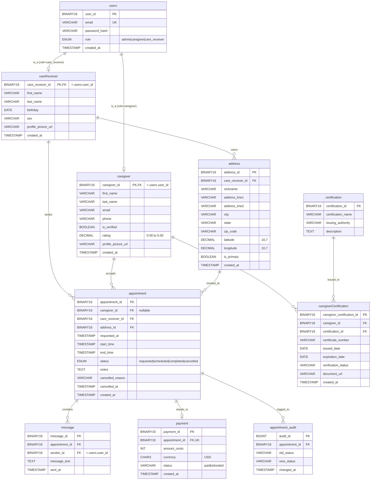

# CareConnect — Data Model (2NF)

This is the relational schema CareConnect runs on. It satisfies **second
normal form (2NF)**: every non-key column depends on the whole primary key
of its table, no partial dependencies. The full normalization analysis is
in [normalization.md](./normalization.md).

The diagram is in Mermaid syntax and renders inline on GitHub.

## Entity-Relationship Diagram

## Cardinality summary

| Relationship | Type | Notes |
|---|---|---|
| `users` → `caregiver` | 1 ↔ 0..1 | `caregiver_id` IS `users.user_id` when `users.role = 'caregiver'` |
| `users` → `careReceiver` | 1 ↔ 0..1 | `care_receiver_id` IS `users.user_id` when `users.role = 'care_receiver'` |
| `careReceiver` → `address` | 1 ↔ N | A receiver can save multiple addresses (home, daughter's house, etc.) |
| `careReceiver` → `appointment` | 1 ↔ N | A receiver books many appointments |
| `caregiver` → `appointment` | 1 ↔ N (nullable) | Null caregiver_id means the request is open |
| `address` → `appointment` | 1 ↔ N | An address can host repeat appointments |
| `appointment` → `message` | 1 ↔ N | Per-appointment chat thread |
| `appointment` → `payment` | 1 ↔ 0..1 | One payment per completed appointment (UNIQUE constraint) |
| `appointment` → `appointment_audit` | 1 ↔ N | Trigger writes one row per status transition |
| `caregiver` → `caregiverCertification` | 1 ↔ N | Multiple certs per caregiver |
| `certification` → `caregiverCertification` | 1 ↔ N | Many caregivers hold the same cert |

## Key design choices

**1. Binary(16) UUIDs as primary keys.** Joshua's schema uses `BINARY(16)` with
`uuid_to_bin()` / `bin_to_uuid()` helpers. This is 16 bytes vs 36 for a
hyphenated string — half the index size, faster joins, no collision risk
across distributed inserts.

**2. Profile-as-PK (caregiver_id = user_id).** Older versions of this schema
had a separate `caregiver_profiles` table with its own ID and a FK to
`users`. Joshua collapsed that: the caregiver row's PK IS the user's PK.
One less hop in every query, no risk of orphan profiles.

**3. Caregiver-less appointments.** `appointment.caregiver_id` is nullable
because requests start unassigned. The status FSM treats
`status = 'requested' AND caregiver_id IS NULL` as the canonical "open
request" — caregivers discover and accept these.

**4. Address belongs to care receivers only.** A caregiver's "service area"
is captured client-side (localStorage) for now; a future migration can add
`caregiver.service_zip` + lat/lng without breaking anything else.

**5. Audit and payment as separate tables.** Both are write-once side
effects of state transitions — keeping them out of `appointment` itself
avoids wide-row anti-patterns and lets us index them independently.
