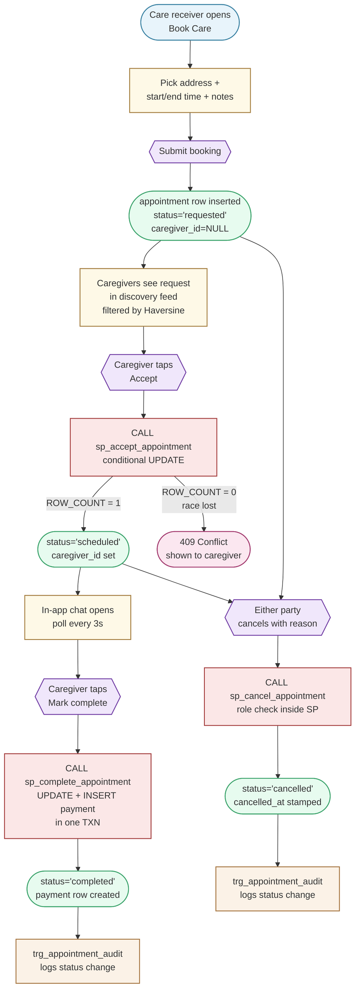
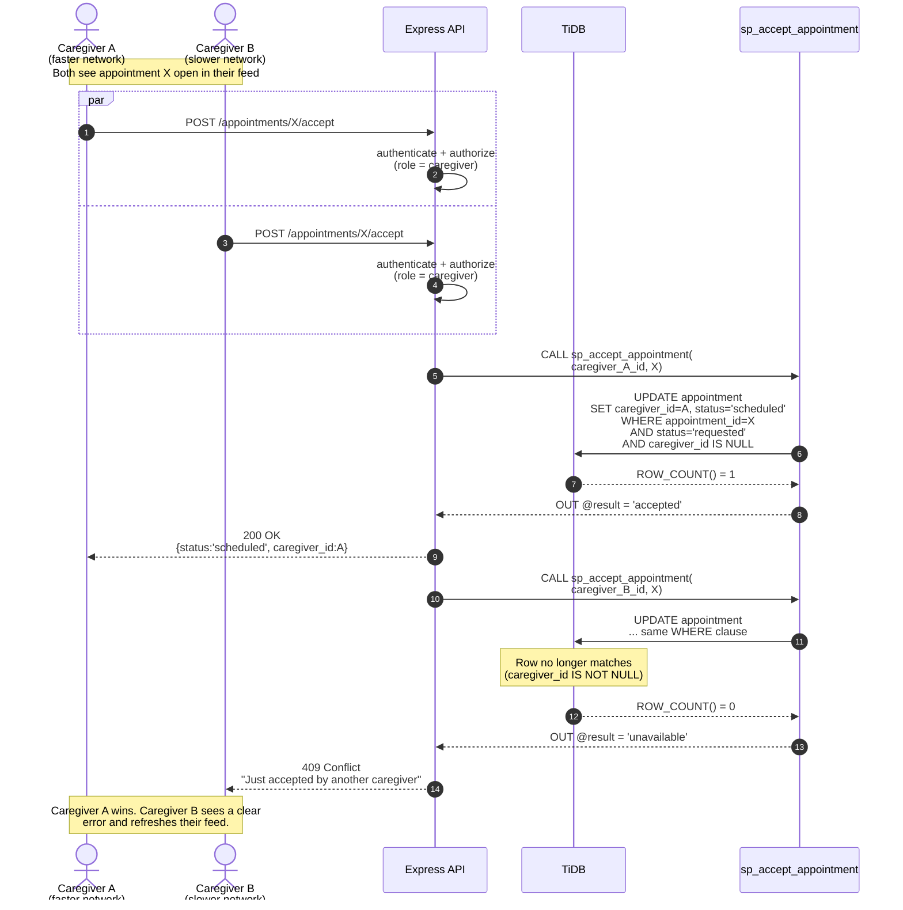
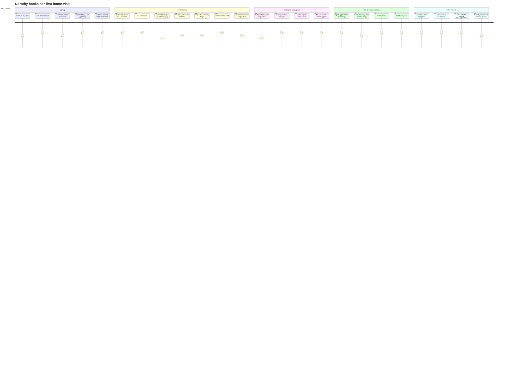

# UML Diagrams — CareConnect

Three diagrams beyond the required Data Model Diagram, satisfying the
project rubric's "three additional UML diagrams" extra-credit item.
All diagrams are Mermaid and render inline on GitHub.

---

## 1. Flow Diagram — Appointment Lifecycle

The booking finite-state machine. Each transition lists who can trigger
it and which database object enforces the rule.

**Key:** Blue = actor. Yellow = UI. Purple = user action. Green = DB
state. Red = stored procedure. Orange = trigger fires. Pink = error
surface.

---

## 2. Sequence Diagram — Race-Safe Accept

What happens when **two caregivers tap Accept on the same open request
at the same time.** This is the scenario the stored procedure exists to
handle correctly.

The crucial detail: the WHERE clause inside the procedure includes
`caregiver_id IS NULL`. The first UPDATE flips that to a UUID; the
second UPDATE no longer matches and silently no-ops. ROW_COUNT() tells
us which side of the race we landed on.

---

## 3. User Journey — Care Receiver's First Booking

The end-to-end experience for a new care receiver from sign-up through
chatting with their caregiver. Touchpoints, emotions, frictions, and
where the platform helps.

The lower scores in "Waiting for a caregiver" reflect the inherent
uncertainty of an open request — nothing the product does badly, just
the intrinsic emotion of "is anyone going to come help my mom?". Future
iterations could surface estimated-time-to-acceptance based on similar
historical requests in the same ZIP.
